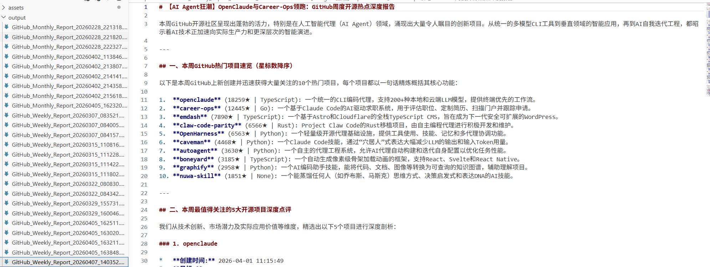
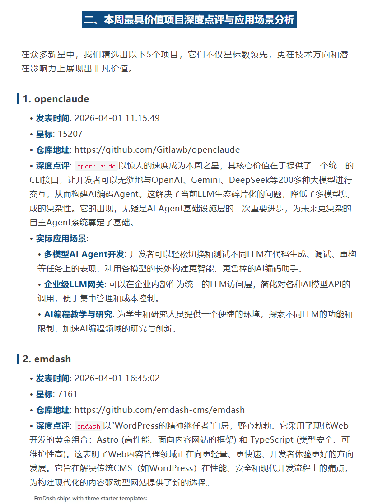

# AutoGetGitHubProjectToArticle

自动抓取 GitHub 热门项目并结合 AI 生成开源趋势报告的工具。

## 功能特点

- 🔍 **自动抓取**：根据指定时间范围获取 GitHub 新创建的热门项目
- 📖 **深度分析**：自动抓取项目 README 内容进行深度分析
- 🤖 **AI 驱动**：使用 Gemini 2.5 Flash 进行智能分析和报告生成
- 📊 **灵活报告**：支持周报/月报两种模式
- 🎯 **精准推荐**：自动筛选高星项目并分析实际应用场景

## 项目结构

```
AutoGetGitHubProjectToArticle/
├── main.py              # 主程序：抓取 GitHub 项目并生成报告
├── ai_model_test.py     # AI 模型测试脚本
├── .gitignore
└── output/              # 生成的报告存储目录（自动创建）
```

## 快速开始

### 1. 安装依赖

```bash
pip install requests google-genai python-dotenv
```

### 2. 配置环境变量

创建 `.env` 文件并配置：

```env
GOOGLE_API_KEY=your_gemini_api_key
PROXY=http://your_proxy:port
```

### 3. 运行程序

```bash
python main.py
```

## 使用说明

在 [`main.py`](main.py) 中配置参数：

```python
REPORT_TYPE = "周度"  # 或 "月度"
START_DATE = "2026-04-01"
END_DATE = "2026-04-05"
```

## 输出示例

程序会生成 Markdown 格式的报告，包含：
- 按 Star 排序的热门项目列表
- 精选项目的深度点评和应用场景分析
- 趋势概要总结
- 项目链接和详细信息

最终生成markdown格式


公众号效果

## 技术栈

- Python 3
- GitHub API v3
- Gemini 2.5 Flash AI
- Requests

## 许可证

MIT
